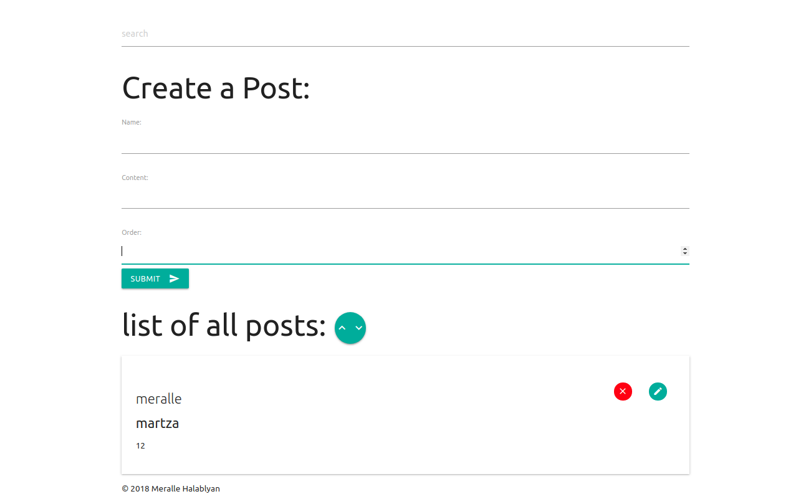

# Superblog API


This is a little node server with CRUD interface:


# Installation
1. Install npm stuff `npm i`
2. Copy some of dependencies that required in your new folder and remove the others like 
    ( `webpack`, `materialize`,`mongoose`, `pug`, `axios`, `express`)
    - using in the app database - MongoDB
  
     *  ```npm install```
   
  3.  Install  bable
  ``` https://babeljs.io/docs/plugins/transform-object-rest-spread ```
  
   4. Create .babelrc folder and paste 
  
    ```{
    "plugins": [
      ["transform-object-rest-spread", { "useBuiltIns": true }]
    ] }```
      
   5. Create .gitignore folder in the folder and add
   
   ``` node_modules , .env ```


Create a copy of env file: `cp .env.example .env`  and set your credentials. Eg:
```
PORT=5000
MONGOURL=mongodb://localhost/superblog
```
# Start node server

`node server/server.js`

# Routes
- GET `/api/posts` all posts
- POST `/api/posts` creates a post. The request body must contain the post itself. See model
- DELETE `/api/posts:id` deletes a post by given id eg: `/api/posts/5ad4ce741a411bc2cb787445`
- PUT `/api/posts:id` deletes a post by given id
  eg: `/api/posts/5ad4ce741a411bc2cb787445`

# Model
```javascript
{
    name: String,
    content: String,
    order: Number
}
```

